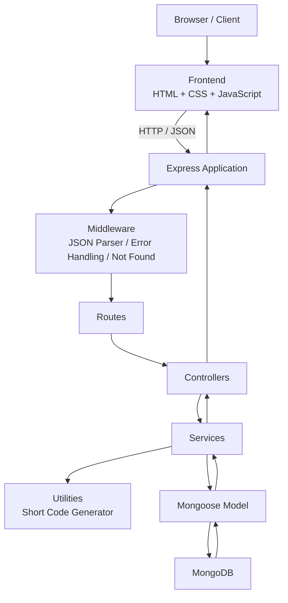
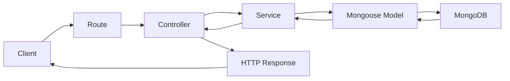
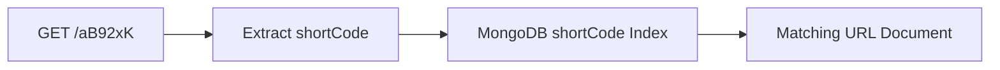
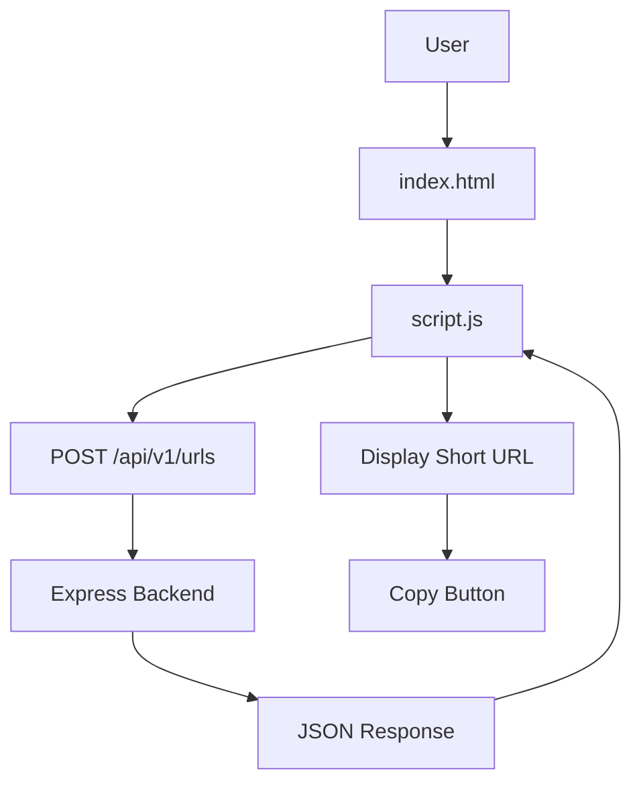
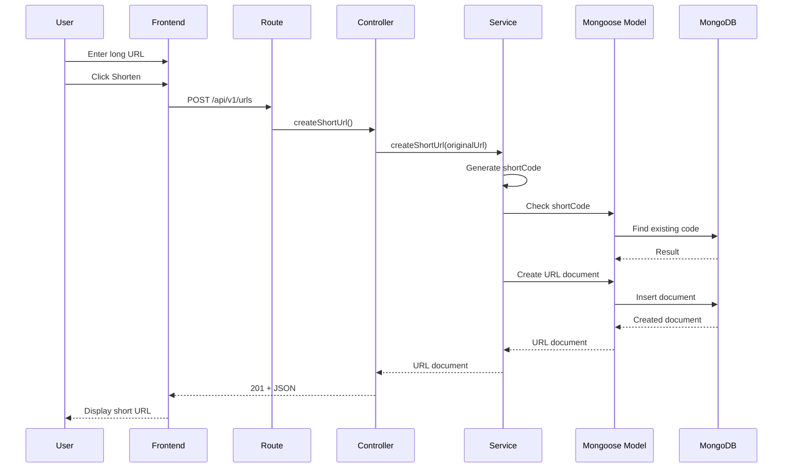
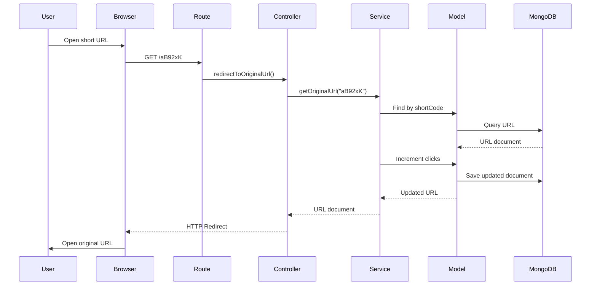
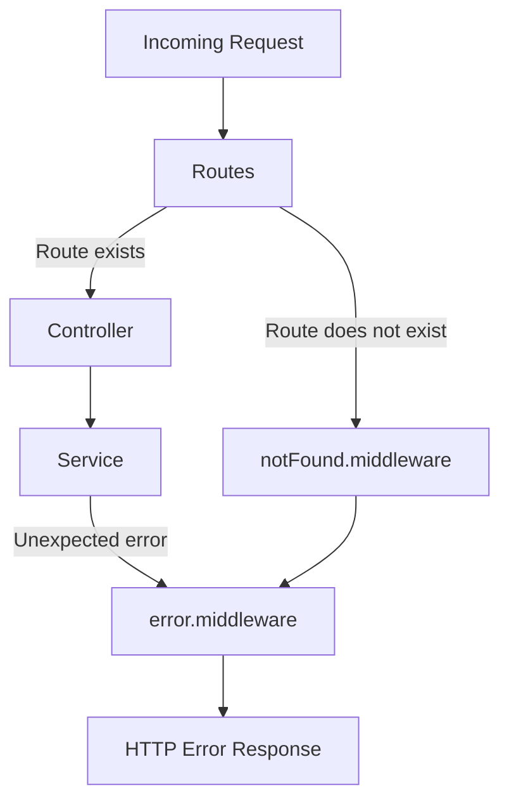
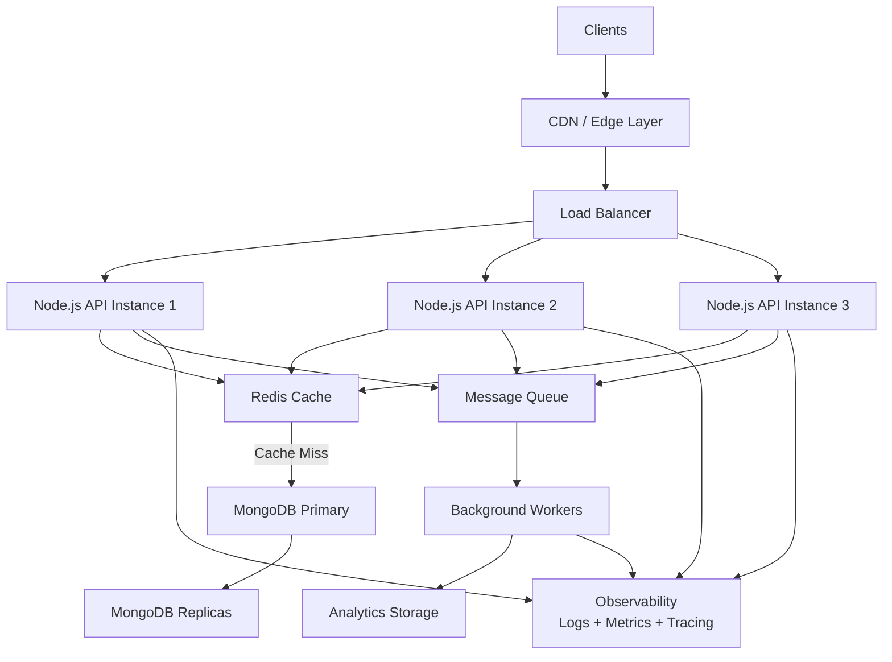
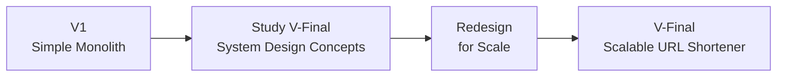

<div align="center">

# 🔗 URL Shortener — V1

**A production-style URL Shortener built to master backend architecture fundamentals**

Node.js · Express.js · MongoDB · Mongoose · REST APIs · Layered Architecture

[](https://nodejs.org/)
[](https://expressjs.com/)
[](https://www.mongodb.com/)
[](https://mongoosejs.com/)
[]()
[]()

</div>

---

> **V1** is the clean, understandable, monolithic implementation of this project — built to internalize proper web-development architecture *before* moving to a scalable, distributed **V-Final** design.

---

## 📌 Table of Contents

| | | |
|---|---|---|
| [Overview](#-project-overview) | [Architecture](#-architecture) | [API Reference](#-api-endpoints) |
| [V1 Goals](#-v1-goals) | [Request Flow](#-request-flow) | [Frontend](#-frontend) |
| [Features](#-features) | [Project Structure](#-project-structure) | [Setup & Installation](#️-installation) |
| [Tech Stack](#-tech-stack) | [Backend Responsibilities](#-backend-responsibilities) | [Testing](#-testing-the-api) |
| [Database Design](#-database-design) | [End-to-End Flows](#-complete-end-to-end-flow) | [Error Handling](#-error-flow) |
| [Architecture Decisions](#-v1-architecture-decisions) | [Limitations](#️-current-v1-limitations) | [V-Final Roadmap](#-v-final-improvements) |
| [Learning Outcomes](#-learning-outcomes) | [Completion Checklist](#-v1-completion-checklist) | [Status](#-v1-status) |

---

## 🚀 Project Overview

The URL Shortener converts a long URL into a short, shareable link.

<table>
<tr>
<td><b>Long URL</b></td>
<td><code>https://www.example.com/articles/backend/system-design/url-shortener</code></td>
</tr>
<tr>
<td><b>Short URL</b></td>
<td><code>http://localhost:5000/aB92xK</code></td>
</tr>
</table>

When a user visits the short URL, the backend looks up the corresponding original URL in MongoDB and issues a redirect. A basic click counter is maintained on every visit.

---

## 🎯 V1 Goals

V1 focuses on building and understanding a **clean, monolithic backend architecture**. Core concepts practiced:

<table>
<tr>
<td width="25%" valign="top">

**Backend**
- Node.js
- Express.js
- REST APIs
- Routing

</td>
<td width="25%" valign="top">

**Architecture**
- Controllers
- Services
- Models
- Middleware

</td>
<td width="25%" valign="top">

**Data Layer**
- MongoDB
- Mongoose ODM
- Database indexing
- Environment variables

</td>
<td width="25%" valign="top">

**Delivery**
- HTTP status codes
- Error handling
- URL redirection
- Frontend integration

</td>
</tr>
</table>

> ⚠️ V1 intentionally does **not** attempt to solve large-scale distributed-systems problems. That's reserved for V-Final.

---

## ✨ Features

**Core**
- ✅ Create a shortened URL
- ✅ Generate random 6-character short codes
- ✅ Persist URLs in MongoDB
- ✅ Redirect short URLs to their original destination
- ✅ Track number of clicks per URL
- ✅ Handle invalid short URLs & unknown routes
- ✅ Centralized error handling
- ✅ JSON REST API

**Frontend**
- ✅ Minimal, responsive HTML/CSS/JS UI
- ✅ Copy shortened URL to clipboard

---

## 🛠 Tech Stack

| Layer | Technologies |
|---|---|
| **Backend** | Node.js, Express.js, Mongoose, MongoDB, dotenv |
| **Frontend** | HTML5, CSS3, Vanilla JavaScript, Fetch API |
| **Tooling** | npm, Nodemon, Postman / Thunder Client / curl, MongoDB Compass |

---

## 🏗 Architecture

V1 follows a **layered monolithic backend architecture** — each layer has a single, well-defined responsibility.



---

## 🔄 Request Flow



| Layer | Responsibility |
|---|---|
| **Route** | Which controller handles this HTTP endpoint? |
| **Controller** | How should this HTTP request/response be handled? |
| **Service** | What business logic should be executed? |
| **Model** | How is the data represented and accessed? |
| **Database** | Stores the actual URL data. |

---

## 📁 Project Structure

```
url-shortener/
│
├── public/
│   ├── index.html
│   ├── style.css
│   └── script.js
│
├── src/
│   ├── config/
│   │   └── db.js
│   │
│   ├── controllers/
│   │   └── url.controller.js
│   │
│   ├── middleware/
│   │   ├── notFound.middleware.js
│   │   └── error.middleware.js
│   │
│   ├── models/
│   │   └── url.model.js
│   │
│   ├── routes/
│   │   └── url.routes.js
│   │
│   ├── services/
│   │   └── url.service.js
│   │
│   ├── utils/
│   │   └── generateCode.js
│   │
│   ├── app.js
│   └── server.js
│
├── .env
├── .gitignore
├── package.json
└── README.md
```

---

## 🧩 Backend Responsibilities

<details>
<summary><b><code>src/server.js</code></b> — Application entry point</summary>
<br>

Responsible for starting the application:

```
Load environment
       ↓
Connect MongoDB
       ↓
Start Express server
```

</details>

<details>
<summary><b><code>src/app.js</code></b> — Express configuration</summary>
<br>

Registers:
- JSON parsing
- Static frontend
- Health endpoint
- URL routes
- Not-found middleware
- Error middleware

> It does **not** start the server.

</details>

<details>
<summary><b><code>src/config/db.js</code></b> — Database connection</summary>
<br>

```
Node.js → Mongoose → MongoDB
```

</details>

<details>
<summary><b><code>src/routes/url.routes.js</code></b> — HTTP endpoints</summary>
<br>

```
POST /api/v1/urls
GET  /:shortCode
```

> The route layer contains **no** business logic.

</details>

<details>
<summary><b><code>src/controllers/url.controller.js</code></b> — HTTP-level operations</summary>
<br>

- Reading `req.body` / `req.params`
- Returning HTTP status codes
- Returning JSON
- Redirecting users
- Passing errors to middleware

</details>

<details>
<summary><b><code>src/services/url.service.js</code></b> — Business logic</summary>
<br>

**Create URL**
```
Receive original URL → Generate short code → Check collision → Store URL → Return URL
```

**Resolve URL**
```
Receive short code → Find URL → Increment clicks → Return URL
```

</details>

<details>
<summary><b><code>src/models/url.model.js</code></b> — Mongoose schema</summary>
<br>

Defines the MongoDB/Mongoose schema representing a URL document.

</details>

<details>
<summary><b><code>src/utils/generateCode.js</code></b> — Short code generator</summary>
<br>

Generates random short codes. Intentionally independent from Express and MongoDB.

</details>

<details>
<summary><b><code>src/middleware/notFound.middleware.js</code></b> & <b><code>error.middleware.js</code></b></summary>
<br>

Handles unmatched routes and provides centralized error handling:

```
Controller → next(error) → Error Middleware → HTTP Response
```

</details>

---

## 🗄 Database Design

**Database:** `url_shortener`  &nbsp;|&nbsp; **Collection:** `urls`

```json
{
  "originalUrl": "https://www.google.com",
  "shortCode": "aB92xK",
  "clicks": 3,
  "createdAt": "2026-08-15T00:00:00.000Z",
  "updatedAt": "2026-08-15T00:05:00.000Z"
}
```

| Field | Type | Purpose |
|---|---|---|
| `originalUrl` | `String` | Original destination URL |
| `shortCode` | `String` | Unique shortened identifier |
| `clicks` | `Number` | Number of redirects |
| `createdAt` | `Date` | Creation timestamp |
| `updatedAt` | `Date` | Last modification timestamp |

### ⚡ Indexing

`shortCode` is configured with `unique: true` and `index: true`, since redirects frequently perform a lookup by short code.



The unique constraint also prevents duplicate short codes.

---

## 🔌 API Endpoints

### 1. Health Check

`GET /health`

```json
{
  "success": true,
  "message": "URL Shortener API is running"
}
```

### 2. Create Short URL

`POST /api/v1/urls` · `Content-Type: application/json`

**Request Body**
```json
{
  "originalUrl": "https://www.google.com"
}
```

**Response** — `201 Created`
```json
{
  "success": true,
  "message": "Short URL created successfully",
  "data": {
    "originalUrl": "https://www.google.com",
    "shortCode": "aB92xK",
    "shortUrl": "http://localhost:5000/aB92xK"
  }
}
```

### 3. Redirect

`GET /:shortCode`

```
shortCode → MongoDB lookup → Increment clicks → Redirect to originalUrl
```

### 4. Invalid Short URL

`GET /doesNotExist` → `404 Not Found`

```json
{
  "success": false,
  "message": "Short URL not found"
}
```

### 5. Invalid Create Request

`POST /api/v1/urls` with `{}` → `400 Bad Request`

```json
{
  "success": false,
  "message": "originalUrl is required"
}
```

---

## 🌐 Frontend

Built with plain **HTML, CSS, and vanilla JavaScript** — no framework required.



---

## 🔐 Environment Variables

Create a `.env` file in the project root:

```env
PORT=5000
MONGO_URI=mongodb://127.0.0.1:27017/url_shortener
```

For MongoDB Atlas:

```env
MONGO_URI=mongodb+srv://<username>:<password>@<cluster>/<database>
```

> 🚫 Never commit `.env` to Git. Ensure `.gitignore` contains:
> ```
> node_modules/
> .env
> ```

---

## 📋 Prerequisites

| Requirement | Check |
|---|---|
| **Node.js** | `node --version` / `npm --version` |
| **MongoDB** (local) | Running at `mongodb://127.0.0.1:27017/url_shortener` |
| **MongoDB Atlas** (alternative) | Cluster connection string in `.env` |

---

## ⚙️ Installation

```bash
# 1. Clone the repository
git clone <your-repository-url>
cd url-shortener

# 2. Install dependencies
npm install

# 3. Create .env (see Environment Variables above)

# 4. Start MongoDB (if running locally)

# 5. Start the development server
npm run dev
```

**Expected output:**
```
MongoDB connected successfully
Server running on port 5000
```

---

## ▶️ Running the Project

1. Open **http://localhost:5000**
2. Enter a URL, e.g. `https://www.google.com`
3. Click **Shorten** → frontend sends `POST /api/v1/urls`
4. Receive a short URL, e.g. `http://localhost:5000/aB92xK`
5. Visiting the short URL redirects to the original destination

---

## 🧪 Testing the API

> Use Postman, Thunder Client, curl, or your browser.

**Health check**
```bash
curl http://localhost:5000/health
```

**Create URL** — Linux / macOS
```bash
curl -X POST http://localhost:5000/api/v1/urls \
-H "Content-Type: application/json" \
-d '{"originalUrl":"https://www.google.com"}'
```

**Create URL** — Windows PowerShell
```powershell
curl.exe -X POST http://localhost:5000/api/v1/urls `
-H "Content-Type: application/json" `
-d '{"originalUrl":"https://www.google.com"}'
```

**Redirect**
```bash
# Open the returned short code in a browser, e.g.:
http://localhost:5000/aB92xK
```

**Invalid short code**
```bash
curl http://localhost:5000/doesnotexist
# → { "success": false, "message": "Short URL not found" }
```

**Invalid request body**
```bash
curl -X POST http://localhost:5000/api/v1/urls \
-H "Content-Type: application/json" \
-d "{}"
# → { "success": false, "message": "originalUrl is required" }
```

---

## 🔄 Complete End-to-End Flow

### Creating a URL



### Redirect Flow



### Error Flow



---

## 🧠 V1 Architecture Decisions

| Decision | Rationale |
|---|---|
| **Node.js** | Lightweight runtime for HTTP backends in JavaScript — teaches event-driven programming, non-blocking I/O, and REST APIs. |
| **Express.js** | Simple framework around Node's HTTP capabilities: routing, middleware, request/response handling. |
| **MongoDB** | Simple integration with Node.js; the URL document (`originalUrl`, `shortCode`, `clicks`, timestamps) maps naturally to a document store. |
| **Mongoose** | Acts as the ODM — provides schemas, models, validation, query APIs, and index definitions. |
| **Service Layer** | Keeps controllers thin: `Controller → Service` moves short-code generation, collision checks, and URL lookups out of the HTTP layer, making logic reusable and testable. |
| **Centralized Error Handling** | `Controller → next(error) → Central Error Middleware → Response` standardizes error responses in one place instead of repeating them across controllers. |

---

## ⚠️ Current V1 Limitations

<table>
<tr><td width="30%"><b>1. Single backend instance</b></td><td>No horizontal scaling — one Node.js server between client and MongoDB.</td></tr>
<tr><td><b>2. No Redis cache</b></td><td>Every redirect requires a live database lookup.</td></tr>
<tr><td><b>3. Basic click counter</b></td><td>Simple read/update/save — not optimized for high concurrency.</td></tr>
<tr><td><b>4. Basic collision handling</b></td><td>Relies on a uniqueness check + DB constraint, without robust duplicate-key race handling/retries.</td></tr>
<tr><td><b>5. No rate limiting</b></td><td>A malicious client can flood the API with requests.</td></tr>
<tr><td><b>6. No authentication</b></td><td>Anyone can create a short URL — no users or ownership.</td></tr>
<tr><td><b>7. No analytics system</b></td><td>Only <code>clicks</code> is tracked — no IP, user agent, referrer, geo, or timestamped events.</td></tr>
<tr><td><b>8. No message queue</b></td><td>URL creation and click processing happen synchronously.</td></tr>
<tr><td><b>9. No load balancer</b></td><td>V1 runs as a single backend instance.</td></tr>
<tr><td><b>10. No distributed architecture</b></td><td>V1 is intentionally a monolith.</td></tr>
</table>

---

## 🚀 V-Final Improvements

After completing V1, the next step isn't to immediately code V-Final — it's to **study the remaining system-design concepts first**, then redesign for scale.



> 📝 This is a **conceptual target architecture**. The final V-Final design will be decided after studying the relevant concepts and identifying actual bottlenecks and requirements.

### 🔮 Planned V-Final Areas

<table>
<tr valign="top">
<td width="20%">

**Scalability**
- Horizontal scaling
- Load balancing
- Stateless API servers
- Database scaling

</td>
<td width="20%">

**Caching**
- Redis
- Cache-aside pattern
- TTL
- Cache invalidation
- Hot URLs

</td>
<td width="20%">

**Database**
- Index optimization
- Read replicas
- Connection pooling
- Atomic operations
- High-concurrency updates

</td>
<td width="20%">

**Distributed Systems**
- Message queues
- Async processing
- Event-driven design
- Idempotency
- Retries & DLQs

</td>
<td width="20%">

**Reliability & Security**
- Health checks
- Circuit breakers
- Rate limiting
- Auth & authorization
- Observability

</td>
</tr>
</table>

**Deployment direction:**
```
Docker → Cloud Infrastructure → Reverse Proxy → Load Balancer → Multiple API Instances
```

---

## 📈 V1 → V-Final Evolution



The goal is **not**:

```
V1 → Randomly add Redis → Add Kafka → Add Docker → Done
```

The goal **is**:

```
Problem → Understand Concept → Identify Bottleneck → Choose Architecture → Implement → Measure Trade-offs
```

That is the system-design mindset this project is meant to build.

---

## 🎓 Learning Outcomes

<table>
<tr valign="top">
<td width="25%">

**Backend Architecture**
- Node.js fundamentals
- Why Express is used
- Routing
- Controllers, services, models
- Separation of concerns
- Middleware

</td>
<td width="25%">

**API Design**
- REST endpoints
- HTTP methods & status codes
- Request body / route params
- JSON & redirect responses

</td>
<td width="25%">

**Database**
- MongoDB documents
- Mongoose schemas & models
- Indexes & unique constraints
- Basic queries

</td>
<td width="25%">

**Application Design & Frontend**
- Env configuration
- Error handling
- Layered architecture
- HTML/CSS/JS + Fetch API

</td>
</tr>
</table>

---

## ✅ V1 Completion Checklist

<table>
<tr valign="top">
<td width="33%">

**Backend**
- [x] Node.js project initialized
- [x] Express configured
- [x] Server created
- [x] Environment variables configured
- [x] MongoDB connected
- [x] Mongoose model created
- [x] Short-code generator created
- [x] Service layer implemented
- [x] Controller layer implemented
- [x] Routes implemented
- [x] Not-found middleware
- [x] Centralized error middleware
- [x] URL creation
- [x] URL redirect
- [x] Click tracking

</td>
<td width="33%">

**Frontend**
- [x] HTML UI
- [x] CSS styling
- [x] JavaScript
- [x] Fetch API integration
- [x] Short URL display
- [x] Copy button
- [x] Basic error display

</td>
<td width="33%">

**Testing**
- [x] Health endpoint
- [x] Create URL
- [x] Redirect URL
- [x] Invalid short URL
- [x] Unknown route
- [x] Invalid request body

</td>
</tr>
</table>

---

## 🏁 V1 Status

<div align="center">

### ✅ V1 — Complete

A fully working URL Shortener built on:

```
HTML · CSS · JavaScript
        ↓
     Node.js
        ↓
     Express
        ↓
      Routes
        ↓
    Controllers
        ↓
     Services
        ↓
    Mongoose
        ↓
    MongoDB
```

**Next up:** study system-design fundamentals → design **V-Final** 🚀

</div>

---

<div align="center">

[](#)

*Turning system-design theory into working code, one project at a time.*

</div>